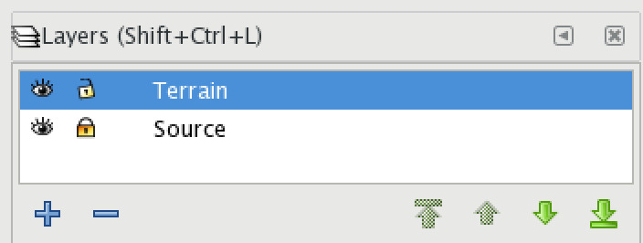

# Open Source Architecture Workflows

Notes on open source workflows within the architecture/building/construction industry.

## Software

 * [Blender]() open source cross-platform 3D modeling and animation program
 * [Inkscape]() open source cross-platform vector editing program with SVG as its native format

## Surveying

### Deciding on a survey type

When deciding on a survey type, the main factors are probably legal requirements, accuracy/coverage and cost.

Many jurisdictions have legal requirements that licensed surveyors output are submitted in order to approve construction work, which eliminates the option of self-survey. However, __traditional surveyors__ are often expensive, slow (2 weeks to get data is considered fast in some markets!) and low resolution, and may have other problems such as spotty coverage and inaccurate approximations interspersed with precise positioning information. While their primary point readings are accurate, their coverage of the space will be really basic and spotty.

__DIY surveying__ with video output from a phone or a drone is possible with open source photogrammetry tools, and will result in point cloud data which can be further processed. Photogrammetry based point cloud surveys are also the norm for large commercial and insturial sites which require large scale surveying. Commercial __point cloud surveyors__ increasingly tend to use cloud based services (drone operator uploads video to third party, waits, downloads dataset). When executed propertly, point clouds provide far better coverage of a site at good accuracy.

All surveys may be complicated by certain types of features (eg. dense foliage).

Finally, you may not need a survey at all. Satellite images can be obtained online for free, and existing site plans can often be obtained from local governments, which increasingly have GIS systems or web GIS portals for this purpose.

#### Tested process: Traditional surveyor PDF to Blender via Inkscape/SVG

To convert a vector PDF from a traditional surveyor to an SVG file that can be imported to Blender without losing any data, you can use the following manual process. Once you have the hang of it, it's not too slow, and gives you the benefit of the freedom to resolve issues with the supplied vector data in an appropriate environment before importing to Blender.

First, open the PDF file in Blender. You will get an import dialog like this.

Import the file, then press __Ctrl+Shift+L__ to show the layers palette, or select __Layer|Layers...__ from the menu.

Now set the existing PDF contents layer's name to "Source" and lock it by clicking the open padlock icon. Then press the plus icon to make a new layer, named "Terrain". Select the "Terrain" layer. Your layers should now look like this.

Now you are going to zoom in and start to trace the data provided by the surveyor, while normalizing it to useful closed vector shapes and noting the associated heights. To begin, select the Bezier drawing tool with __Shift+F6__ or by clicking the icon.

