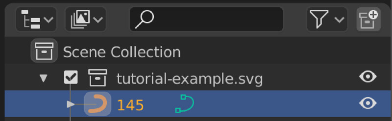

# Open Source Architecture Workflows

Notes on open source workflows within the architecture/building/construction industry.

## Software

 * [Blender]() open source cross-platform 3D modeling and animation program
 * [Inkscape]() open source cross-platform vector editing program with SVG as its native format

## Surveying

### Deciding on a survey type

When deciding on a survey type, the main factors are probably legal requirements, accuracy/coverage and cost.

Many jurisdictions have legal requirements that licensed surveyors output are submitted in order to approve construction work, which eliminates the option of self-survey. However, __traditional surveyors__ are often expensive, slow (2 weeks to get data is considered fast in some markets!) and low resolution, and may have other problems such as spotty coverage and inaccurate approximations interspersed with precise positioning information. While their primary point readings are accurate, their coverage of the space will be really basic and spotty.

__DIY surveying__ with video output from a phone or a drone is possible with open source photogrammetry tools, and will result in point cloud data which can be further processed. Photogrammetry based point cloud surveys are also the norm for large commercial and insturial sites which require large scale surveying. Commercial __point cloud surveyors__ increasingly tend to use cloud based services (drone operator uploads video to third party, waits, downloads dataset). When executed propertly, point clouds provide far better coverage of a site at good accuracy.

All surveys may be complicated by certain types of features (eg. dense foliage).

Finally, you may not need a survey at all. Satellite images can be obtained online for free, and existing site plans can often be obtained from local governments, which increasingly have GIS systems or web GIS portals for this purpose.

#### Tested process: Traditional surveyor PDF to Blender via Inkscape/SVG

To convert a vector PDF from a traditional surveyor to an SVG file that can be imported to Blender without losing any data, you can use the following manual process. Once you have the hang of it, it's not too slow, and gives you the benefit of the freedom to resolve issues with the supplied vector data in an appropriate environment before importing to Blender.

First, open the PDF file in Blender. You will get an import dialog like this.

Import the file, then press __Ctrl+Shift+L__ to show the layers palette, or select __Layer|Layers...__ from the menu.

Now set the existing PDF contents layer's name to "Source" and lock it by clicking the open padlock icon. Change its opacity to 30% to facilitate tracing.  You should see it lighten a little bit. 

Then press the plus icon to make a new layer, named "Terrain". Select the "Terrain" layer. Your layers should now look like this.

Now you are going to zoom in and start to trace the data provided by the surveyor, while normalizing it to useful closed vector shapes and noting the associated heights. To begin, select the Bezier drawing tool with __Shift+F6__ or by clicking the icon.

Now zoom in to the image so that you can see clearly one single area described by the surveyor as a whole vector shape. For example, the top left corner of your survey. The view should look something like this.

You should then draw the bezier out, noting Inkscape's ability to snap accurately to the PDF contents, and wind up with a fully enclosed shape like this.

Zoomed in further, the shape now looks like this.

Press __Ctrl+Shift+F__ or select the __Fill and Stroke__ panel, then set the fill to black and the stroke to X (none). The shape should now look like this.

We now want to set the properties of the object to store the height as indicated by the surveyor, using the __Object Properties__ panel (__Shift+Ctrl+O__). The ID field text will be visible and associated with the object when we import the SVG we create from the PDF in Inkscape in to our target Blender scene, so we want to set it to the number of meters above sea level, eg. '145'. If you have more than one object with the same height, just call it '145 (unique string here)' like '145 iaousdiau' or '145 bottom of garden' to maintain the uniqueness restraint.

Repeat the process to include all terrain heights as fully enclosed vectors, store the SVG, and import in to Blender as follows.

First, ensure that you have the __Import-Export: Scalable Vector Graphics (SVG) 1.1 Format__ add-on enabled in __Blender Preferences__' __Add-ons__ section.

Now select __File|Import|Scalable Vector Graphics__.

After importing you should see the height text associated with each terrain object in the __Scene Collection__ view.

The overall drawing should be visible in the main view.

Now you simply need to scale each vector to the appropriate height. The fast way to do this is to first determine the vertical point (meters above sea level) that you want to model as zero. For example if most of your heights range from 140-160 meters above sea level then you might choose 140 meters above sea level as your vertical zero point.

Then select the vector shape in question, press tab to toggle to the edit mode, press A to select all vertices on the vector shape, execute your extrusion using the keyboard (S+Z+(number-of-meters-above-sea-level-less-the-height-of-your-vertical-origin-point)+enter) (eg. 145-140=5, so S+Z+5+ENTER), exit edit mode back to object mode with tab, select the next vector and repeat. You can cover a large number of vectors quite quickly this way. 

In the end you will have a reasonably detailed model, potentially better than the original survey as you have considered the errors and omissions within it and resolve them during your vector cleanup.

With a little more work you can add trees, nearby features and so forth, then have a good basis for moving forward on any conceptual design or renovations.

## Shadow modeling

Blender is ideal for shadow models. Once you have your structure and terrain in to Blender, install the __Lighting: Sun Position__ add-on.

Once it is configured with your site coordinates and true north offset (available either on the survey or via mobile phone applications), you can then use time of year and time of day modification controls to set up screenshots of the top orthographic view. Paste these in to Inkscape and trace significant features such as major shadow lines. You can do this multiple times with different features excluded from the scene to create very accurate shadow models to greatly exceed the expectations of local regulators who are used to simplistic output from commercial modeling tools. For example, in order to show the minimum impact of a built environment change, you might indicate shadows cast by existing foliage or fences separately.

Here is an example screenshot.

## Construction related CNC fabrication work

There are definitely a lot of open source programs capable of producing output for CNC systems which are used to prepare materials for construction, including but not limited to timber, metal, plastic and glass. In practice, however, normally these systems are owned by a third party supplier and specifications are sent to them as drawings, after which they re-digitize the drawings as files for their CNC systems.

Low hanging fruit for CNC are things like sheet metal cutting (usually done with fiber lasers), wooden sheet cutting, timber and metal beam cutting, hole drilling and thread tapping. Classic examples would be windows, CNC cut benchtops, laser cut privacy screens, stairs, aluminium window modules and roller shutter units.

## Structural and Thermal Analysis

See [learning material for Code Aster and Salome Meca](https://wiki.osarch.org/index.php?title=Learning_Material_for_Code_Aster_and_Salome_Meca).
